  

<h1 align="center">🛡️ Awesome IoT Device Security & Management Ecosystem</h1>

  <strong>Curated Directory of Enterprise SaaS Security Platforms, Industrial OT Defense, & Open-Source Firmware Auditing Tools</strong>

  

---

## 📌 Executive Summary & Key Keywords

This repository tracks notable **commercial IoT security platforms**, **industrial cyber-physical defense systems (ICS/OT)**, and **open-source security frameworks** that discover, monitor, patch, and protect connected devices — spanning agentless network visibility, post-quantum cryptography, firmware binary reverse-engineering, SBOM generation, and automated incident response.

**Core Focus Areas**: `IoT Device Discovery` • `Vulnerability Management` • `Firmware Security Analysis` • `LoRaWAN Security` • `Manufacturer Usage Description (MUD)` • `Zero Trust OT Defense` • `Software Supply Chain Security`

---

## 📑 Table of Contents

- [🏢 SaaS & Commercial Hosted Platforms](#-saas--commercial-hosted-platforms)
- [⚡ Open-Source GitHub Projects](#-open-source-github-projects)
  - [🔍 Firmware Analysis & Reverse Engineering](#-firmware-analysis--reverse-engineering)
  - [🌐 IoT Platforms & Core Infrastructure](#-iot-platforms--core-infrastructure)
  - [📜 MUD (Manufacturer Usage Description) & Behavioral Tools](#-mud-manufacturer-usage-description--behavioral-tools)
- [🤝 How to Contribute](#-how-to-contribute)
- [⚠️ Disclaimer](#%EF%B8%8F-disclaimer)
- [☕ Support & Sponsorship](#-support--sponsorship)
- [⭐ Star History](#-star-history)

---

## 🏢 SaaS & Commercial Hosted Platforms

The global IoT security market size is estimated at **$7.5 Billion to $10 Billion** (projected to reach over $30 Billion by 2030), and the sector is **moderately fragmented** with specialized pure-play vendors (Armis, Claroty, Nozomi) alongside cloud hyperscalers (Microsoft, AWS) and acquired specialists.

| Platform / Product | Company Size / Valuation / Revenue | Description & Key Features | Pricing (Starting Tier) | Free Tier Limit / Trial |
| :--- | :--- | :--- | :--- | :--- |
| **[Microsoft Defender for IoT](https://azure.microsoft.com/en-us/products/defender-for-iot/)** 🛡️ | **$3.1 Trillion** market cap (Parent Microsoft) | **Microsoft's IoT/OT security platform** — agentless network monitoring and threat detection. Best for Azure-native IoT security. | **$1,500/month** per site (Extra Small OT site tier, up to 100 devices) or **$3/device/month** (Enterprise IoT add-on) | **30-day free trial** for up to 1,000 devices per site |
| **[AWS IoT Device Defender](https://aws.amazon.com/iot-device-defender/)** ☁️ | **$2.1 Trillion** market cap (Parent Amazon) | **AWS's managed IoT security service** — audit, detect, and mitigate security issues across IoT fleets. Best for AWS-native IoT security. | **$1.00 per 10,000 active device principals/month** (Audit) + **$0.002 per 1,000 metric datapoints** (Detect) | **1 month free tier** (Includes fleet audit coverage & 1M metric datapoints) |
| **[Armis Centrix](https://www.armis.com/)** 🎯 | **$6.1 Billion** valuation (~$340M ARR) | **Agentless IoT/OT security platform** — continuous monitoring and strict access controls for connected devices. Nvidia cybersecurity AI integration for critical infrastructure. Best for agentless asset discovery and Zero Trust. | **$10,000/year** baseline enterprise starter license (~$5-$10/device/year at scale) | **30-day interactive free trial** (Armis Centrix Platform demo environment) |
| **[Claroty](https://www.claroty.com/)** 🏭 | **$3.0 Billion** valuation (~$200M ARR) | **Cyber-physical systems protection platform** — visibility for industrial control systems and OT environments. Threat detection and exposure management. Best for industrial IoT and OT security. | **$15,000/year** base platform license + tier per monitored node/sensor | **14-day guided sandbox trial** upon sales request |
| **[Forescout](https://www.forescout.com/)** 🌐 | **$1.9 Billion** acquisition valuation (PE Advent) | **Pervasive network security** — continuous monitoring and access control of IT, OT, IoT, and IoMT assets. Best for heterogeneous network visibility. | **$7,500/year** base appliance/virtual deployment tier (~$15-$25/endpoint/year) | **30-day virtual appliance evaluation license** |
| **[Nozomi Networks](https://www.nozominetworks.com/)** ⚡ | **$1.0 Billion** acquisition valuation (~$101M ARR) | **Real-time visibility and cybersecurity for ICS and critical infrastructure** — network & endpoint visibility with AI threat detection. Acquired by Mitsubishi Electric. Best for critical infrastructure protection. | **$12,000/year** base subscription for Guardian sensor virtual appliance | **30-day free trial** for Vantage cloud management platform |
| **[Vdoo](https://www.vdoo.com/)** 🔐 | **$300 Million** acquisition valuation (Acquired by JFrog) | **IoT security and certification platform** — automated device security and firmware analysis integrated into JFrog DevOps ecosystem. | **$25,000/year** (integrated into JFrog Xray / Enterprise Security bundle starting tier) | **14-day free trial** of JFrog Platform (includes Xray security scanning features) |
| **[Finite State](https://www.finitestate.io/)** 📦 | **$120 Million** valuation ($72.8M funding raised) | **Software risk management for connected devices** — firmware analysis and software supply chain security (Acquired MergeBase). Best for connected device risk management. | **$18,000/year** starter tier for firmware binary and SBOM analysis | **14-day free trial** / sample firmware scan evaluation |
| **[Karamba Security](https://www.karamba.com/)** 🚗 | **$50 Million** estimated valuation ($27M funding raised) | **Automotive and IoT cybersecurity** — on-device runtime protection and binary hardening for ECU/embedded firmware. | **$10,000/year** initial development & licensing evaluation kit tier | **30-day proof-of-concept trial** for XGuard embedded runtime agent |
| **[Sternum](https://www.sternum.io/)** 📟 | **$40 Million** estimated valuation ($20M funding raised) | **IoT security platform** — patchless on-device monitoring, runtime protection, and observability for connected embedded devices. | **$5,000/year** starter tier for device fleet observability & protection | **21-day trial account** with free ARM-based hardware evaluation kit (or free tier for up to 3 OpenWrt devices) |

---

## ⚡ Open-Source GitHub Projects

Below is a curated list of top open-source projects for IoT security, firmware reverse-engineering, MUD generation, and network security monitoring — sorted in descending order by **GitHub Star Count**.

### 🔍 Firmware Analysis & Reverse Engineering

- **[Binwalk](https://github.com/ReFirmLabs/binwalk)**   
  🛠️ **Firmware extraction & analysis tool** — Industry standard for searching, extracting, and analyzing embedded firmware image files, file systems, and executable code.

- **[Qiling Framework](https://github.com/qilingframework/qiling)**   
  🕹️ **Advanced binary emulation framework** — Cross-platform and multi-architecture binary emulation engine used for malware analysis and dynamic firmware vulnerability hunting.

- **[EMBA (Embedded Analyzer)](https://github.com/e-m-b-a/emba)**   
  🔬 **Deep firmware security analyzer** — Designed by Siemens security engineers for automated security analysis, vulnerability detection, and static/dynamic emulation of Linux-based embedded firmware.

- **[Firmware Analysis Toolkit (FAT)](https://github.com/attify/firmware-analysis-toolkit)**   
  🧰 **Automated firmware emulation toolkit** — Built on top of Firmadyne to automate firmware extraction and full QEMU system emulation for dynamic vulnerability exploitation.

- **[mithril](https://github.com/nmatt0/mithril)**   
  🔍 **IoT static scanner for firmware content analysis** — Scans for embedded secrets, firmware SBOM (CycloneDX/SPDX), CVE matching, leaked SSH keys, and boot posture without active network connections.

- **[UniBOM](https://ora.ox.ac.uk/objects/uuid:003eb0e1-5e6c-404e-b484-33358e8d7bb7)** 📄  
  📊 **Advanced IoT SBOM generation & visualization tool** — Combines binary, filesystem, and C/C++ source code analysis for memory-safety vulnerability classification in router binaries.

---

### 🌐 IoT Platforms & Core Infrastructure

- **[Mongoose OS](https://github.com/cesanta/mongoose-os)**   
  ⚙️ **Secure IoT firmware development framework** — Supports ESP32, STM32, and CC3200 with built-in mTLS, AWS IoT / Azure integration, OTA updates, and hardware crypto acceleration.

- **[Magistrala](https://github.com/absmach/magistrala)**   
  🚀 **Cloud-native Go IoT platform** (formerly Mainflux) — Provides fine-grained object access control, mTLS device provisioning, workspace multi-tenancy, and high-performance message routing.

- **[Argus](https://github.com/mgs042/Argus)**   
  📡 **LoRaWAN network security monitoring** — Integrates with Chirpstack to detect replay attacks, packet flooding, RF jamming, frame counter resets, and suspicious gateway movements.

- **[Quantum IoT Security](https://github.com/garrv105/quantum-iot-security)**   
  🔑 **Post-quantum IoT security framework** — Features lattice-based key exchange (Kyber-compatible), lightweight anomaly detection (Isolation Forest), automated quarantine, and NIST compliance reporting.

---

### 📜 MUD (Manufacturer Usage Description) & Behavioral Tools

- **[MUDgee](https://github.com/ayyoob/mudgee)**   
  📝 **Automated MUD profile generator** — Generates formal IETF MUD profiles from raw PCAP network traffic traces for IoT behavioral baseline enforcement.

- **[MUD-PD](https://www.nist.gov/news-events/news/2025/08/final-nist-ir-8349-released-characterize-secure-your-iot-devices)** 🏛️  
  📋 **NIST device behavior characterization tool** — Implements NIST IR 8349 guidelines for generating and verifying Manufacturer Usage Description files for enterprise IoT.

- **[MUDIS](https://deepness-lab.org/wp-content/uploads/2022/03/222052.pdf)** 🔬  
  ⚖️ **MUD Inspection & Comparison System** — Dockerized web platform for evaluating, comparing (Jaccard similarity), and generalizing MUD profiles across firmware releases.

---

## 🤝 How to Contribute

1. Fork the repository.
2. Create a feature branch (`git checkout -b feature/new-iot-tool`).
3. Add your entry to `README.md` following the tabular or badged structure.
4. Ensure factual descriptions and direct GitHub/official links.
5. Submit a Pull Request! 🚀

---

## ⚠️ Disclaimer

- This directory is **community-curated** for educational, architectural, and evaluation purposes.
- Enterprise IoT environments handle critical operational technology (OT). Ensure proper network segmentation and compliance before executing firmware analysis or security monitoring tools.

---

## ☕ Support & Sponsorship

If you find this repository valuable for your research, security engineering, or IoT deployment, please consider supporting the project:

- ⭐ **Star this repository** to help others discover it!
- 🔀 **Fork & Share** with your network.
- 💖 **Sponsor the Maintainer**: [Buy a Coffee on GitHub Sponsors](https://github.com/sponsors/ishandutta2007)

Thank you for helping build a safer connected IoT ecosystem! 🛡️✨

---

## ⭐ Star History

